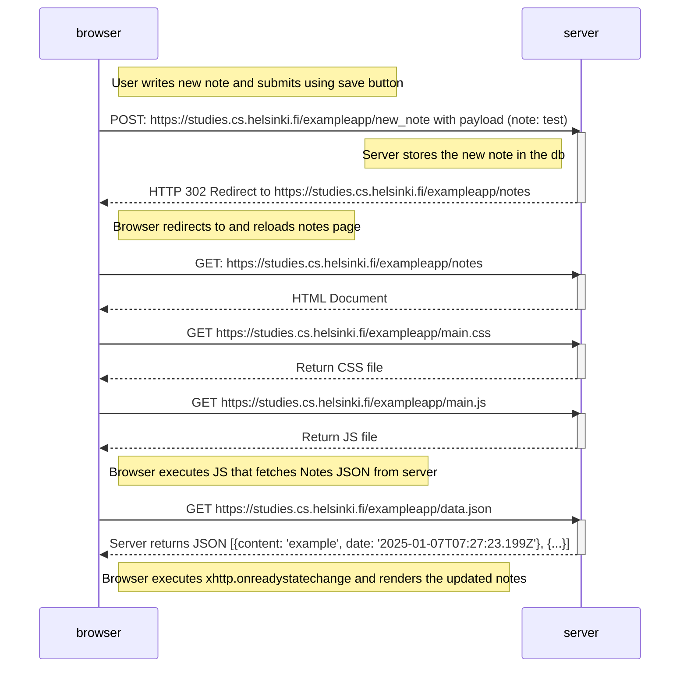

```mermaid
sequenceDiagram
    participant browser
    participant server

    Note right of browser: User writes new note and submits using save button
    browser->>server: POST: https://studies.cs.helsinki.fi/exampleapp/new_note with payload (note: test)

    activate server
    Note left of server: Server stores the new note in the db
    server -->> browser: HTTP 302 Redirect to https://studies.cs.helsinki.fi/exampleapp/notes
    deactivate server

    Note right of browser: Browser redirects to and reloads notes page
    browser->>server: GET: https://studies.cs.helsinki.fi/exampleapp/notes

    activate server
    server-->>browser: HTML Document
    deactivate server

    browser->>server: GET https://studies.cs.helsinki.fi/exampleapp/main.css

    activate server
    server-->>browser: Return CSS file
    deactivate server

    browser->>server: GET https://studies.cs.helsinki.fi/exampleapp/main.js

    activate server
    server-->>browser: Return JS file
    deactivate server

    Note right of browser: Browser executes JS that fetches Notes JSON from server

    browser->>server: GET https://studies.cs.helsinki.fi/exampleapp/data.json

    activate server
    server-->>browser: Server returns JSON [{content: 'example', date: '2025-01-07T07:27:23.199Z'}, {...}]
    deactivate server

    Note right of browser: Browser executes xhttp.onreadystatechange and renders the updated notes
```
