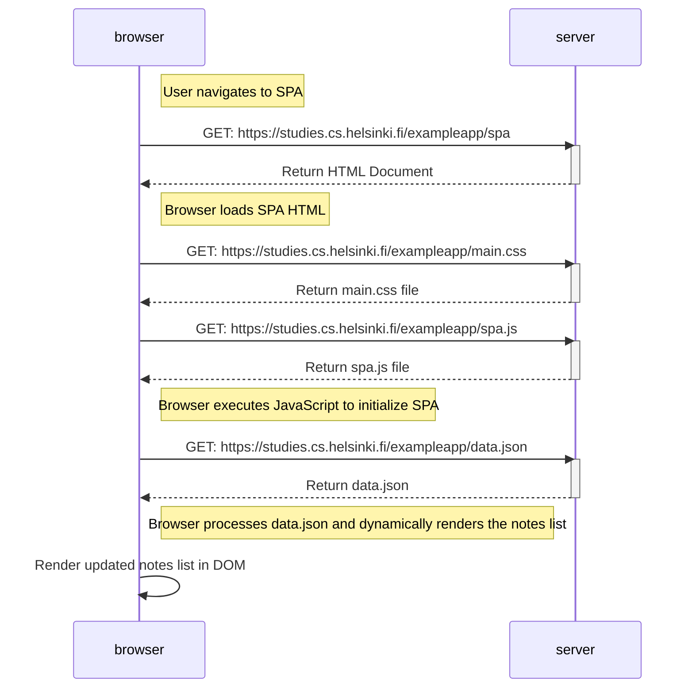

```mermaid
sequenceDiagram
    participant browser
    participant server

    Note right of browser: User navigates to SPA
    browser->>server: GET: https://studies.cs.helsinki.fi/exampleapp/spa

    activate server
    server-->>browser: Return HTML Document
    deactivate server

    Note right of browser: Browser loads SPA HTML
    browser->>server: GET: https://studies.cs.helsinki.fi/exampleapp/main.css

    activate server
    server-->>browser: Return main.css file
    deactivate server

    browser->>server: GET: https://studies.cs.helsinki.fi/exampleapp/spa.js

    activate server
    server-->>browser: Return spa.js file
    deactivate server

    Note right of browser: Browser executes JavaScript to initialize SPA
    browser->>server: GET: https://studies.cs.helsinki.fi/exampleapp/data.json

    activate server
    server-->>browser: Return data.json
    deactivate server

    Note right of browser: Browser processes data.json and dynamically renders the notes list
    browser->>browser: Render updated notes list in DOM
```
