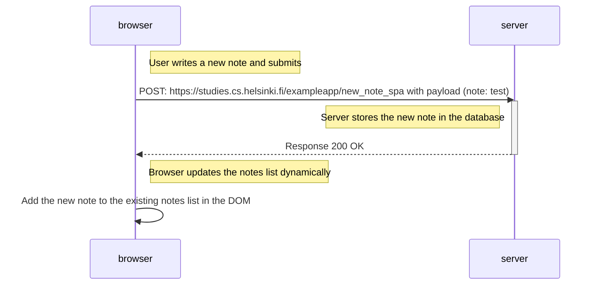

```mermaid
sequenceDiagram
    participant browser
    participant server

    Note right of browser: User writes a new note and submits
    browser->>server: POST: https://studies.cs.helsinki.fi/exampleapp/new_note_spa with payload (note: test)

    activate server
    Note left of server: Server stores the new note in the database
    server-->>browser: Response 200 OK
    deactivate server

    Note right of browser: Browser updates the notes list dynamically
    browser->>browser: Add the new note to the existing notes list in the DOM
```
